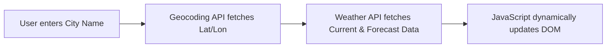

---
```markdown
# 🌦️ Weather Takedown

[](https://developer.mozilla.org/en-US/docs/Web/HTML)
[](https://developer.mozilla.org/en-US/docs/Web/CSS)
[](https://developer.mozilla.org/en-US/docs/Web/JavaScript)
[](https://open-meteo.com/)
[](LICENSE)

A modern, responsive weather dashboard providing real-time meteorological insights and multi-day forecasts. Built using vanilla frontend technologies and powered by the high-performance, open-source **Open-Meteo API**. 

Features a sleek, glassmorphism-inspired user interface optimized for all device types.

---

## ✨ Features

- **Dynamic Search:** Query real-time weather information for any city globally.
- **Comprehensive Metrics:** Displays current temperature, humidity levels, wind speed, and descriptive weather conditions.
- **Extended Forecast:** Provides a multi-day outlook to plan ahead.
- **Robust Error Handling:** Gracefully handles invalid location queries or network failures with user-friendly alerts.
- **Modern UI/UX:** Responsive glassmorphism styling with seamless transitions, adapting beautifully to mobile, tablet, and desktop viewports.
- **Zero Dependencies:** Pure vanilla HTML, CSS, and JS for blazing-fast load times.

---

## 📸 Preview

> 💡 *Replace the placeholder paths below with your actual project screenshots once hosted or committed.*

| Desktop View | Mobile View |
| :---: | :---: |
|  |  |

---

## 🎨 Design System & Typography

To ensure maximum readability, modern aesthetics, and a premium dashboard feel, this project implements a professional, dual-font typographic scale:

*   **Headings & Key Metrics:** [Poppins](https://fonts.google.com/specimen/Poppins) (Geometric Sans-Serif) — Used for high-impact elements like temperature displays, titles, and city names to give a clean, structured, and modern aesthetic.
*   **Body & UI Metadata:** [Inter](https://fonts.google.com/specimen/Inter) (Technical Sans-Serif) — Highly legible UI-optimized font used for supporting data, labels, and weather descriptions.

### Palette Overview
```css
--glass-bg: rgba(255, 255, 255, 0.1);
--glass-border: rgba(255, 255, 255, 0.2);
--text-primary: #ffffff;
--text-secondary: #e2e8f0;

```

---

## 🛠️ Architecture & Tech Stack

* **Frontend:** HTML5, CSS3 (Custom Variables, Flexbox, Grid)
* **Typography:** Google Fonts (Poppins, Inter)
* **Scripting:** JavaScript (ES6+ Asynchronous Fetch API)
* **Data Providers:**
* [Open-Meteo Geocoding API](https://open-meteo.com/en/docs/geocoding-api) (Coordinates resolution)
* [Open-Meteo Weather API](https://open-meteo.com/) (Meteorological data retrieval)


---

## 📂 Project Structure

```text
Weather-Nexus/
├── assets/
│   ├── background/    # UI background images/art
│   ├── icons/         # Weather condition dynamic icons
│   └── images/        # Repository preview screenshots
├── index.html         # Application core structure
├── style.css          # Glassmorphic layout & responsive styling
├── script.js          # Core application logic & API orchestration
├── LICENSE            # MIT License terms
└── README.md          # Project documentation

```

---

## 💻 How It Works

The application operates as a sequential asynchronous pipeline:



1. **Geocoding Phase:** The user input is dispatched to the Open-Meteo Geocoding API to resolve the city name into accurate latitude and longitude coordinates.
2. **Weather Retrieval Phase:** These coordinates are immediately fed into the primary Open-Meteo Weather API to pull current metrics and forecast arrays.
3. **DOM Rendering:** The JavaScript engine parses the JSON payload, dynamically building UI elements and applying the corresponding weather icons.

---

## 🚀 Getting Started

### Prerequisites

No build tools, compilation, or package installations are required. You only need a modern web browser.

### Installation & Local Setup

1. **Clone the repository:**
```bash
git clone [https://github.com/yourusername/weather-nexus.git](https://github.com/yourusername/weather-nexus.git)

```


2. **Navigate to the project directory:**
```bash
cd weather-nexus

```


3. **Launch the application:**
Simply double-click `index.html` to open it in your default browser, or serve it using a local server extension (e.g., Live Server in VS Code).

---

## 🎯 Roadmap & Future Enhancements

* [ ] **Geolocation API Integration:** Auto-detect and load the user's current local weather on initialization.
* [ ] **Granular Forecasts:** Add a togglable hourly forecast slider.
* [ ] **Persistence:** Save "Favorite Cities" utilizing browser `localStorage`.
* [ ] **Enhanced Visuals:** Interactive weather charts (using Chart.js) and animated micro-interactions for weather states.
* [ ] **Accessibility:** Implement full semantic HTML adjustments and Dark/Light mode tokens.

---

## 🤝 Contributing

Contributions make the open-source community an amazing place to learn, inspire, and create. Any contributions you make are **greatly appreciated**.

1. Fork the Project
2. Create your Feature Branch (`git checkout -b feature/AmazingFeature`)
3. Commit your Changes (`git commit -m 'Add some AmazingFeature'`)
4. Push to the Branch (`git push origin feature/AmazingFeature`)
5. Open a Pull Request

---

## 📄 License

Distributed under the MIT License. See `LICENSE` for more information.

---

## 👨‍💻 Author

**Sandy**

*Computer Science Student & Full Stack Developer*

* **GitHub:** [@yourusername](https://github.com/yourusername)
* **LinkedIn:** [Your Name](https://www.google.com/search?q=https://linkedin.com/in/yourusername)

---

## ⭐ Support

If you found this project helpful or like the design, please consider giving it a **Star**! It takes less than a second and genuinely motivates developers to keep building.

```

```